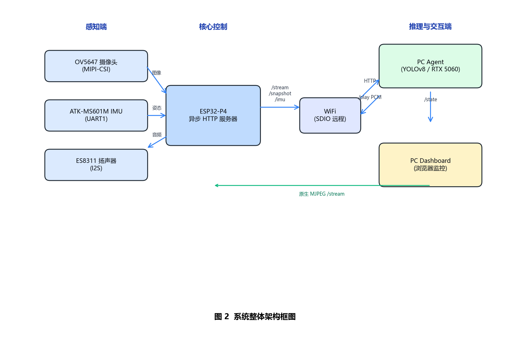

# Guide Glasses (导盲眼镜)

[中文版本](./README_CN.md)

A wearable assistive prototype for visually impaired pedestrians, built on **ESP32-P4 + OV5647 camera + speaker + ATK-MS601M IMU**, with perception and guidance offloaded to a PC-side Agent.

> **Status**: Research prototype. The current architecture uses a Wi-Fi connected PC for heavy inference (YOLO + Qwen-VL); the wearable side handles image capture, IMU reading, audio playback, and HTTP serving.

---

## Features

- **Real-time object detection**: pedestrians, vehicles, traffic lights, blind lanes, zebra crossings, obstacles, etc.
- **IMU-based orientation**: ATK-MS601M 6-axis sensor provides Roll / Pitch / Yaw for mapping on-screen objects to real-world directions.
- **Local path guidance**: follow blind lanes or choose a safe traversable direction when no lane is present.
- **Voice prompts**: Chinese natural-language announcements delivered to the onboard speaker.
- **Web dashboard**: lightweight HTML overlay for live MJPEG stream, detection boxes, and IMU state.
- **Cloud fallback**: complex or uncertain scenes are sent to Qwen-VL (DashScope) for high-level scene understanding.

---

## System Architecture



```text
┌─────────────────────────────────────────────┐
│  ESP32-P4 (wearable)                        │
│  OV5647 ──→ JPEG ──→ HTTP (/snapshot.jpg)   │
│  ATK-MS601M ──→ UART ──→ IMU (/imu)         │
│  Speaker ←── PCM ←── POST /play             │
└─────────────────┬───────────────────────────┘
                  │ Wi-Fi / HTTP
                  ▼
┌─────────────────────────────────────────────┐
│  PC Agent (Python)                          │
│  FrameGrabber → YOLO → guidance logic       │
│  ↳ Qwen-VL fallback (DashScope)             │
│  ↳ edge-tts / pyttsx3 → PCM → /play         │
│  ↳ Dashboard (http://localhost:8080)        │
└─────────────────────────────────────────────┘
```

Other flow diagrams are available under [`./assets`](./assets).

---

## Hardware

| Component | Purpose |
|-----------|---------|
| ESP32-P4 dev board | Main MCU, Wi-Fi (via `esp_wifi_remote` + companion chip), camera ISP, audio I2S |
| OV5647 MIPI camera | Image capture |
| On-board speaker / audio amp | Voice playback |
| ATK-MS601M (ICM-20602 + STM32) | 6-axis IMU, UART output of fused attitude angles |
| NVIDIA GPU PC | Runs YOLO inference and the PC Agent |
| Wi-Fi AP | Communication between wearable and PC |
| Power bank | Outdoor power |

---

## Repository Structure

```text
.
├── assets/              # Diagrams and flowcharts
├── components/          # ESP-IDF local components
├── docs/                # Design documents (Chinese)
├── main/                # ESP-IDF firmware source
├── managed_components/  # ESP-IDF managed components
├── pc_agent/            # PC-side Python agent
│   ├── pc_agent.py      # Main perception + guidance loop
│   ├── dashboard.py     # Web dashboard server
│   ├── dashboard.html   # Dashboard UI
│   ├── frame_grabber.py # MJPEG stream reader
│   ├── qwen_agent.py    # Qwen-VL cloud agent
│   ├── tts_helper.py    # Offline TTS helper
│   └── tests/           # Test scripts
├── scripts/             # Windows build/flash/run helpers
├── tools/               # IMU HTML dashboard generator
├── .env.example         # Example environment variables
├── .gitignore
├── CMakeLists.txt       # ESP-IDF project entry
├── LICENSE
├── README.md
├── README_CN.md
├── requirements.txt
└── sdkconfig*           # ESP-IDF configuration
```

---

## Quick Start

### 1. Clone and configure

```bash
git clone <repo-url>
cd guide-glasses
```

Copy the example environment file and fill in your keys:

```bash
cp .env.example .env
# Edit .env with your DashScope API key, Wi-Fi credentials, etc.
```

> **Never commit `.env` to Git.** It is already ignored.

### 2. Build and flash the ESP32-P4 firmware

Open an ESP-IDF terminal (v5.5.4 recommended) and run:

```bash
idf.py set-target esp32p4
idf.py menuconfig   # Set Wi-Fi SSID / password under Example Connection Configuration
idf.py build
idf.py -p PORT flash monitor
```

On Windows you can also use the provided helpers:

```powershell
.\scripts\build_p4.bat
.\scripts\flash_p4.bat
```

### 3. Run the PC Agent

Install Python dependencies (Python 3.10+ recommended):

```bash
cd pc_agent
pip install -r ../requirements.txt
```

Start the main agent:

```bash
python pc_agent.py --host <esp32-ip-or-mdns>
```

Start the Qwen-VL-only agent (no local GPU needed):

```bash
python qwen_agent.py --host <esp32-ip-or-mdns>
```

Open the dashboard at `http://localhost:8080`.

---

## Configuration

Key items in `menuconfig`:

- **Wi-Fi SSID / password**: `Example Connection Configuration`
- **Camera resolution**: `Example Configuration → Camera preview resolution` (default 800×480)
- **Audio / SD card**: `Example Configuration → AUDIO_SPEAKER_ENABLE / SD_CARD_ENABLE`
- **Partition table**: `CONFIG_PARTITION_TABLE_SINGLE_APP_LARGE=y` for 2 MB app partition

Key environment variables (see `.env.example`):

| Variable | Purpose |
|----------|---------|
| `DASHSCOPE_API_KEY` | DashScope API key for Qwen-VL |
| `WIFI_SSID` / `WIFI_PASSWORD` | Optional, for scripts that need them |
| `EDGE_TTS_PROXY` | Optional HTTP proxy for `edge-tts` |
| `ESP32_HOST` | Optional default ESP32 IP |

---

## Model Weights

The PC Agent expects YOLO weights. The following models were used during development but are **not included** in this repository because of their size:

- `yolov8n.pt` — official Ultralytics COCO pretrained model (download via `ultralytics`)
- `yolo26n.pt` — custom trained model for guide-glasses classes

Place your own `.pt` files in a `models/` directory (ignored by Git) or update the `MODEL_PATH` in the agent scripts accordingly.

---

## License

This project is licensed under the [MIT License](./LICENSE).

---

## Acknowledgements

- Espressif ESP-IDF and ESP32-P4 examples
- Ultralytics YOLO
- Alibaba Cloud DashScope / Qwen-VL
